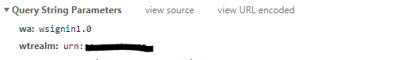

Set Charge Permissions
==========================

*SetChargePermissions.exe* is a utility to
1. Reset the permission to the list and then break the permission inheritance of each charge item created in affected billing cycle. 
2. For each charge item in affected billing cycle, grant group *"&lt;prefix-of-group&gt;&lt;account&gt;"* read-only access.

*SetChargePermissions.exe* expects following call syntax:

```
"SetChargePermissions.exe" [options] <URL>
```
where \<URL> points to the Sharepoint site and [options] are

* -p|--prefix_of_group=\<string>
	
	Prefix of the account groups. The prefix is useful to prevent group name conflicts with other groups defined in same site collection
* -c|--cycle_start_date=\<date>
	
	Billing cycle start date in the format YYYY-MM-DD.
* -h|--charges_list_name=\<string>

	Name of charges list if renamed.
* -s|--auth_scheme=\<ntlm|adfs>

	Authentication scheme. Default to ntlm if absent.
* -S|--adfs_server=\<string>

	ADFS server such as sts3.mycorp.com. No default value. Required if auth_scheme is adfs.
* -P|--relying_party=\<string>

	ADFS relying party such as urn:sp.mycorp.com. No default value. Required if auth_scheme is adfs. To find out relying party, inspect the http request to ADFS server by opening the browser web debug console. Look for the wtrealm query string parameter as shown
	
	
* -u|--username=\<string>

	Login user name. No default value. Required if auth_scheme is adfs. If auth_scheme is ntlm and if this option is not set, then the Windows account running the program will be used for login to SharePoint. The login account should have adequate privilege to modify Sharepoint list items and permissions. Make the account a site collection administrator is recommended.
* -D|--domain=\<string>

	Login user domain. No default value. Required if auth_scheme is adfs. If auth_scheme is ntlm and if this option is not set, then the Windows account running the program will be used for login to SharePoint.
* -w|--password=\<string>

	Login user password. No default value. Required if auth_scheme is adfs. If auth_scheme is ntlm and if this option is not set, then the Windows account running the program will be used for login to SharePoint.

Examples:

* SetChargePermissions.exe -c "2018-01-01" -p "Billing Group - " https://mycorp.com/service/billing

  Run on charge items with billing cycle start date 2018-01-01. Set the prefix of all SharePoint groups used to grant clients accessing the Charges table to "Billing Group - ".

* SetChargePermissions.exe -c "2018-01-01" -s adfs -S sts3.mycorp.com -P urn:sp.mycorp.com -u foo -D mycorp -w changeMe https://mycorp.com/service/billing
  
  Run on charge items with billing cycle start date 2018-01-01. Authenticate to Sharepoint with ADFS.

## System Requirements and Access Privileges
* Site collection administrator level of access to any edition of SharePoint 2013 or above.
* Optionally Git client to download package

## Installation
1. Use *Download Zip* button to download the latest version, or use Git client to clone the git repo. 

## License

The MIT License (MIT)

Copyright (c) 2014-present @abbr

Permission is hereby granted, free of charge, to any person obtaining a copy
of this software and associated documentation files (the "Software"), to deal
in the Software without restriction, including without limitation the rights
to use, copy, modify, merge, publish, distribute, sublicense, and/or sell
copies of the Software, and to permit persons to whom the Software is
furnished to do so, subject to the following conditions:

The above copyright notice and this permission notice shall be included in all
copies or substantial portions of the Software.

THE SOFTWARE IS PROVIDED "AS IS", WITHOUT WARRANTY OF ANY KIND, EXPRESS OR
IMPLIED, INCLUDING BUT NOT LIMITED TO THE WARRANTIES OF MERCHANTABILITY,
FITNESS FOR A PARTICULAR PURPOSE AND NONINFRINGEMENT. IN NO EVENT SHALL THE
AUTHORS OR COPYRIGHT HOLDERS BE LIABLE FOR ANY CLAIM, DAMAGES OR OTHER
LIABILITY, WHETHER IN AN ACTION OF CONTRACT, TORT OR OTHERWISE, ARISING FROM,
OUT OF OR IN CONNECTION WITH THE SOFTWARE OR THE USE OR OTHER DEALINGS IN THE
SOFTWARE.
